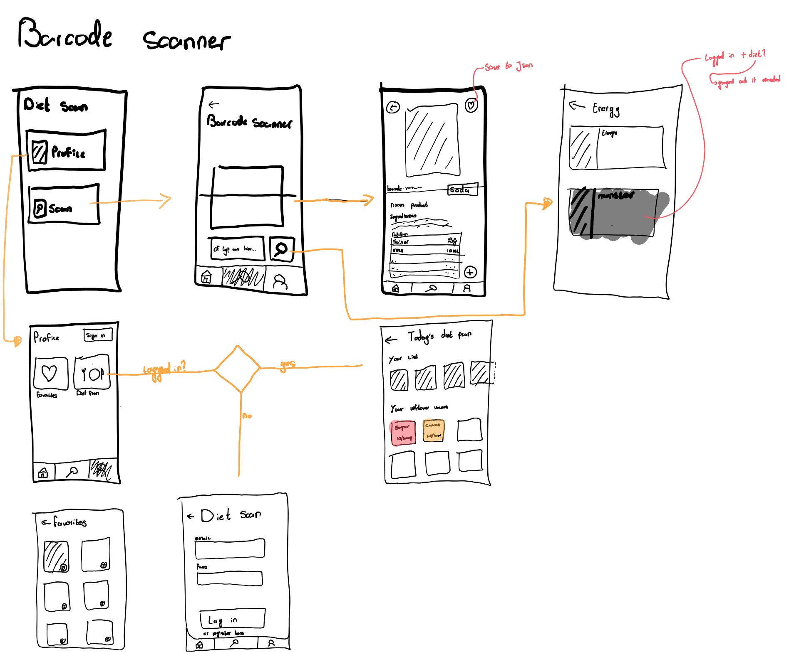

# Week 1

While listening to the teachers and reading the assignment I made some quick notes of what I had to do. At the left are all the options of assignments. 


I chose the barcode scanner because I found it interesting to be able to make a barcode scanner. I immediatly wanted to make a diet app. which makes the assignment even harder because I want users to be able to sign up and sign in.



I made a wireflow of the app I somewhat want to build. I hope I'll be able to make this completely.

## The setup
I wanted to build this using NodeJS, react and MongoDB.
**However** after one and a half day I found out that I was not allowed to serve anything from the back-end nor that I could use NodeJs in general.

I did however ask ChatGPT how I could make this with NodeJS. just to get a general idea

It gave me a general idea on how to do it. I started the application. and set up the main.js back-end javascript file. I set 

```JS
/* Main.js */

const port = 3000;

import http from 'http';
import { connectToDatabase } from './js/database.js';
import { testFetch } from './js/fetch.js';
import * as fs from 'fs';

const testJson = './assets/json/product.json'

const server = http.createServer((request, response) => {
    response.statusCode = 200;
    response.setHeader('Content-Type', 'text/plain');
    response.end('Hallo wereld\n');
});

server.listen(port, () => {
    console.log(`Server is running at http://localhost:${port}/`);
    connectToDatabase()

    if (!fs.existsSync(testJson)) {
        testFetch()
    } else {
        fetch = JSON.parse(fs.readFileSync(testJson, 'utf8'));
        console.log(fetch)
        console.log('heey')
    }

});
```

I also set up a mongoDB database connection. I used dotenv to make sure people can't read the databaseURL which contains the 'secret' password key
```JS
import { MongoClient } from 'mongodb';
import dotenv from 'dotenv';

dotenv.config()

export async function connectToDatabase() {

    const url = process.env.DB_URL;
    return MongoClient.connect(url)

        .then(client => {
            console.log('Verbonden met de database');
            return client.db();
        })

        .catch(error => {
            console.error('Fout bij het verbinden met de database:', error);
            process.exit(1);
        });
}
```

And I made the fetch to get data from the api like so
```JS
var testUrl = 'https://world.openfoodfacts.org/api/v0/product/90162909.json'

import * as fs from 'fs';

export function testFetch() {
    fetch(testUrl)
        .then((res) => {
            if (!res.ok) {
                throw new Error(`HTTP error: ${response.status}`);
            }
            return res.json()
        })
        .then((data) => {
            console.log(data)
            const testJson = './assets/json/product.json'
            fs.writeFile("./assets/json/product.json", JSON.stringify(data), 
            function (err) {
                if (err) throw err;
                console.log('complete');
            }
            );
        })
        .catch((error) => test.textContent = `Could not fetch verse: ${error}`);
}
```

### Struggles
I got stuck on several things. The first thing I tried to do was write out the fetch to a json file so that if a fetch has already been done on a specific query, you wouldn't have to fetch again. I haven't fully implemented this yet, but I managed to write with 'fs'. Only I got stuck because nodemon was constantly rebooting my server. After some struggling it turned out to be a change that naturally takes place because I create a file. as a result, nodemon restarts the server. You can fix this by creating a nodemon.json file and ignoring things in it like so
```JSON
{
    "ignore": [
        "*.json"
    ]
}
```

### The moment of sadness
after that I made this I was told that I was not allowed to use NodeJS at all. luckily I could use the fetch I made but anything other than that was not usable for this project.

## The setup #2

To make the webcam work I had to use a build-in Javascript API called "Barcode Detection API"
This api is able to read out multiple barcode formats.

It took me a while to find this api. I tried several guides which used other libraries to make this work but in the end that was alsno not allowed.
I read the following ones:
1. [Building HTML5 Barcode Reader with Pure JavaScript SDK | by Xiao Ling | Medium](https://yushulx.medium.com/building-html5-barcode-reader-with-pure-javascript-sdk-842391372818)
2. [QuaggaJS, an advanced barcode-reader written in JavaScript (serratus.github.io)](https://serratus.github.io/quaggaJS/)
3. [QR and barcode scanner using HTML and Javascript | Minhaz’s Blog (minhazav.dev)](https://blog.minhazav.dev/QR-and-barcode-scanner-using-html-and-javascript/)

So after trying to use the Barcode Detection API I found many issues. most of them told me that the function was not supported anymore. 


After struggling for what felt like an eternity I started asking my teacher what to do. He hinted towards polyfill. After that I quickly made it work by linking polyfill with these scripts

```HTML
    <script src="https://cdn.jsdelivr.net/npm/@undecaf/zbar-wasm@0.9.11/dist/index.js"></script>
    <script src="https://cdn.jsdelivr.net/npm/@undecaf/barcode-detector-polyfill@0.9.13/dist/index.js"></script>
    <script>
        try {
            window['BarcodeDetector'].getSupportedFormats()
        } catch {
            window['BarcodeDetector'] = barcodeDetectorPolyfill.BarcodeDetectorPolyfill
        }
    </script>
```

My barcode scanner finally worked with the following code:

```JS
var startCamera = document.querySelector('section > button:first-of-type')
startCamera.addEventListener('click', () => {
    // Check if device has camera
    if (navigator.mediaDevices && navigator.mediaDevices.getUserMedia) {
        // Use video without audio
        const constraints = {
            video: true,
            audio: false
        }
        // Start video stream
        navigator.mediaDevices.getUserMedia({
            audio: false, video: {
                facingMode: 'environment'
            }
        }).then(stream => video.srcObject = stream)
            .catch(console.error);
        setInterval(detectCode, 1000);
    }
})
```
So in the code above I have requested the camera from the device when I press on the button. I also change the video object to the actual stream. After that I call another function with an interval of every second.

```JS
let formats; //wat voor barcode / qr code ze kunnen scannen
// Save all formats to formats var
BarcodeDetector.getSupportedFormats().then(arr => formats = arr);
// Create new barcode detector with all supported formats
const barcodeDetector = new BarcodeDetector({ formats });
// Detect code function
const detectCode = () => {
    // Start detecting codes on to the video element
    barcodeDetector.detect(video).then(codes => {
        // If no codes exit function
        if (codes.length === 0) return;
        for (const barcode of codes) {
            // Log the barcode to the console
            // console.log(barcode);
            console.log(barcode.rawValue)
            const barcodeValue = barcode.rawValue
            fetchBarcodeData(barcodeValue)
            return;
        }
    }).catch(err => {
        // Log an error if one happens
        console.error(err);
    })
}
```
The function above enables me to log the barcode of each format which is available in the API. after I logged the barcode I passed the data to another function.

```JS
function fetchBarcodeData(barcodeValue) {
    var testUrl = `https://world.openfoodfacts.org/api/v0/product/${barcodeValue}.json`
    console.log(testUrl)
    fetch(testUrl)
        .then((res) => {
            if (!res.ok) {
                throw new Error(`HTTP error: ${response.status}`);
            }
            return res.json()
        })
        .then((data) => {
            console.log(data)
        })
}
```
The passed data from the previous function is added to the url to search a product. This url is used to fetch data and transform the received data to a json format.
I log this data in the console.

```JS
var stopCamera = document.querySelector('section > button:last-of-type').addEventListener('click', () => {
    const mediaStream = video.srcObject;
    const tracks = mediaStream.getTracks();
    tracks.forEach(track => track.stop())
    // https://dev.to/morinoko/stopping-a-webcam-with-javascript-4297
})
```
To disable the stream I added a button which stops the track of the mediastream which is in the svideo source object.
I used a guide for this : [click this link](https://dev.to/morinoko/stopping-a-webcam-with-javascript-4297)
